> go version go1.24.2 linux/arm64

# Level-triggered and edge-triggered
https://man7.org/linux/man-pages/man7/epoll.7.html

Go 原生的 `net` 是使用 `EPOLLET` (Edge Triggered) 的方式來處理事件通知。

## Golang TCP Server
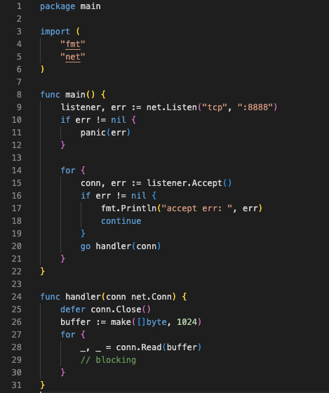

## Golang 如何讓使用者感受到主塞

### Listen
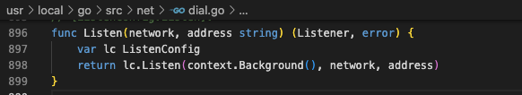
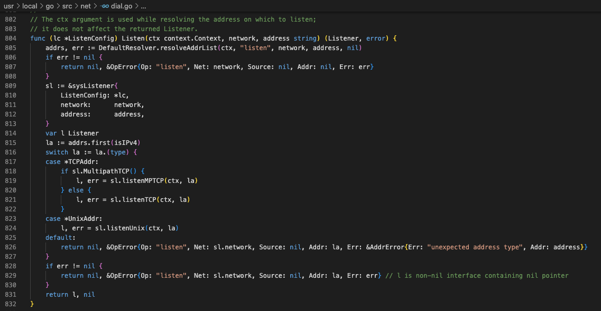
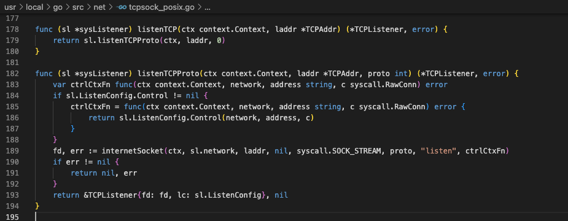
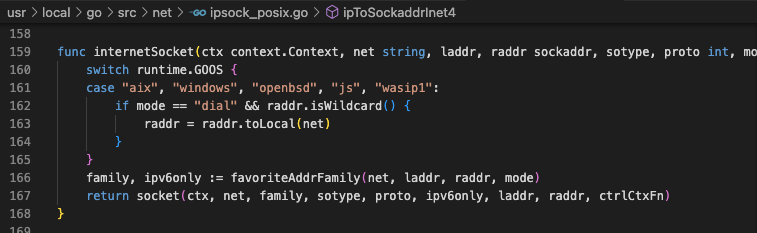
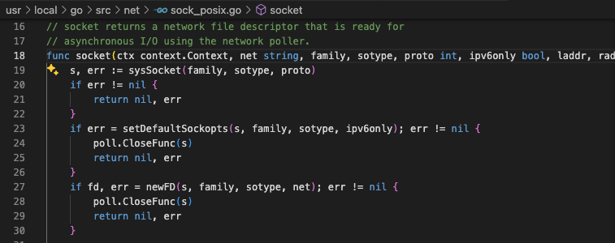

#### 這邊可以看到 `SOCK_NONBLOCK`

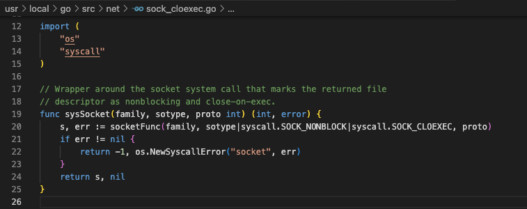

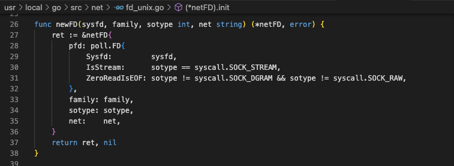
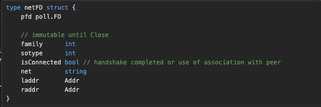
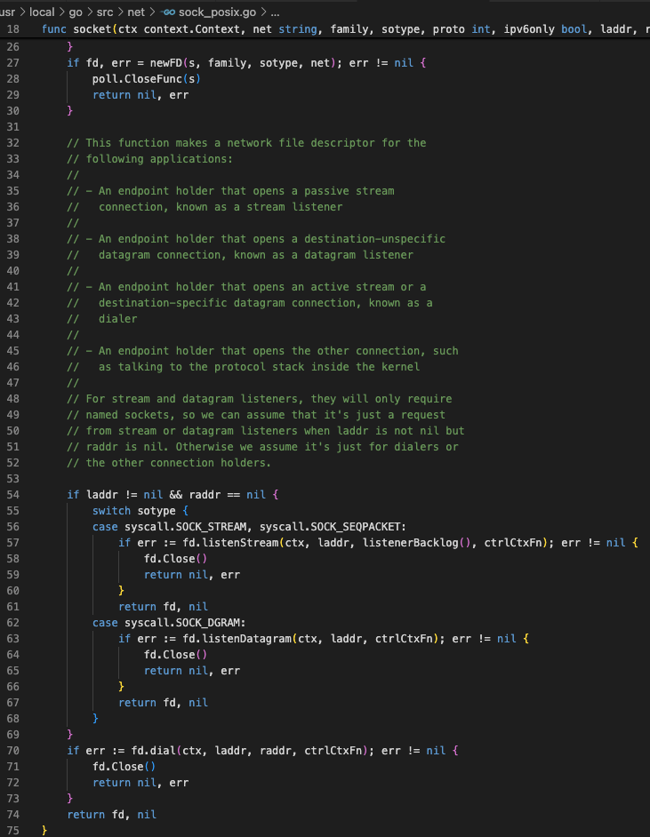
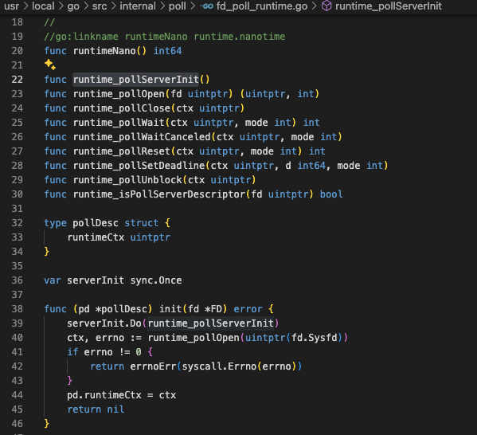
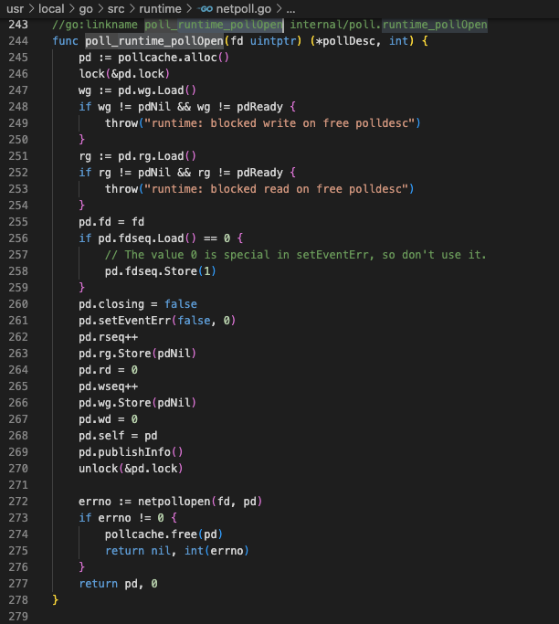

#### `EPOLLET` - Edge Triggered

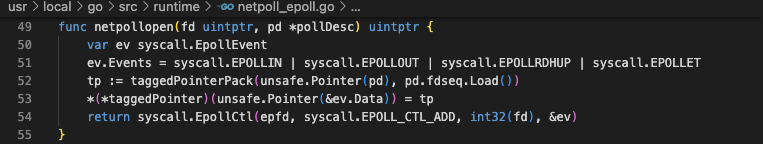

### Accept
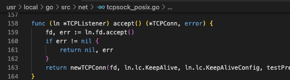
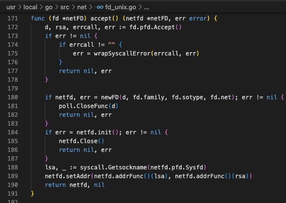
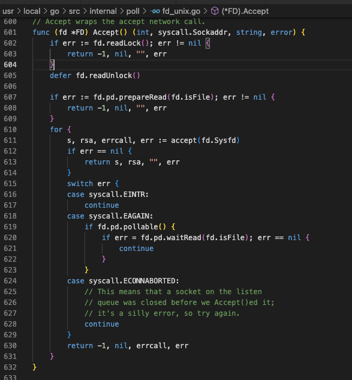
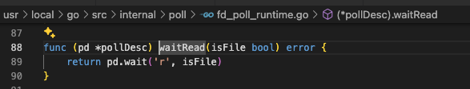
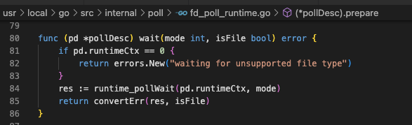
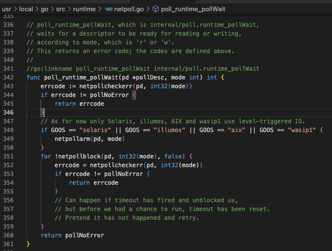
#### 可以看到 wait 時會呼叫 `gopark`
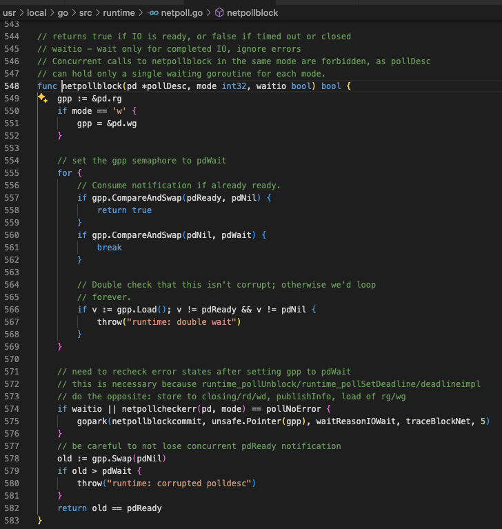

### Listener
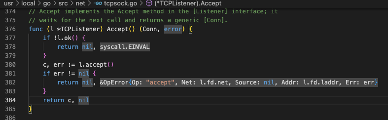

### Read
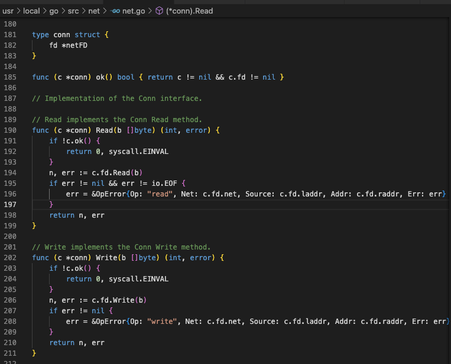
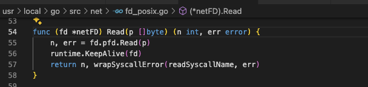
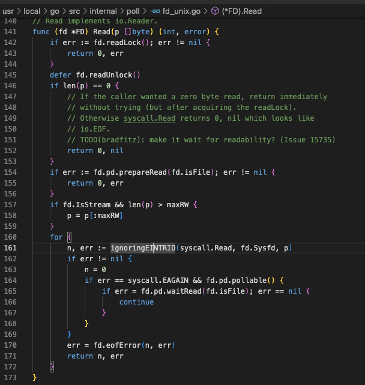
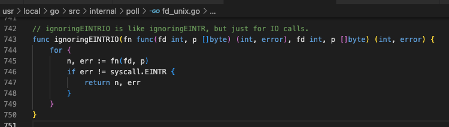

#### 這裡一樣使用 `pd.wait` 去呼叫 `gopark`
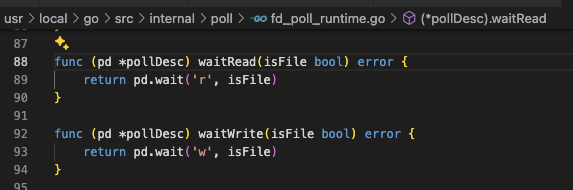

### 什麼時候喚醒 ?
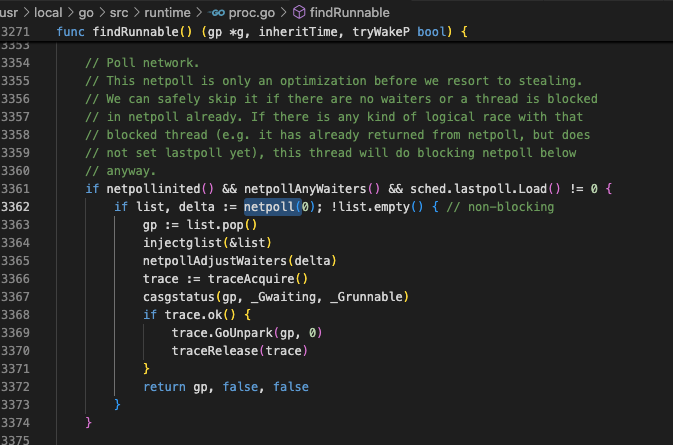

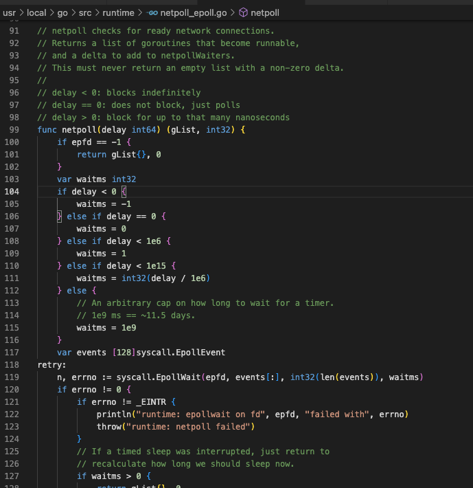
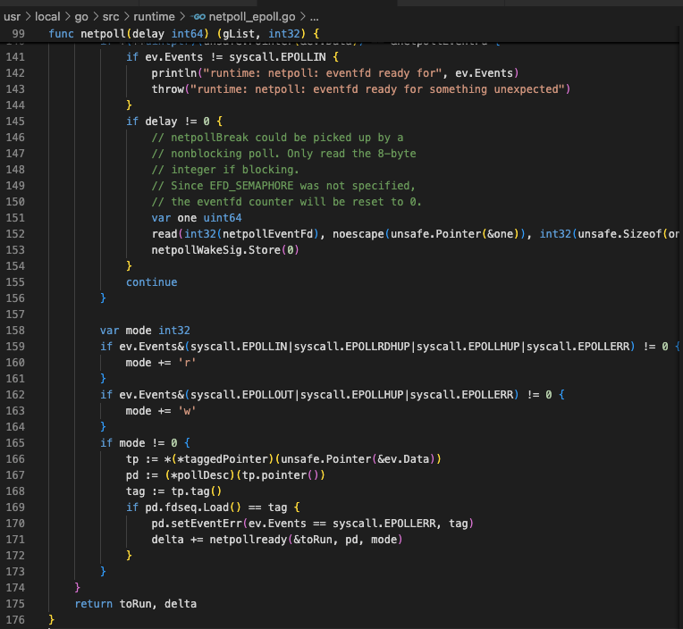
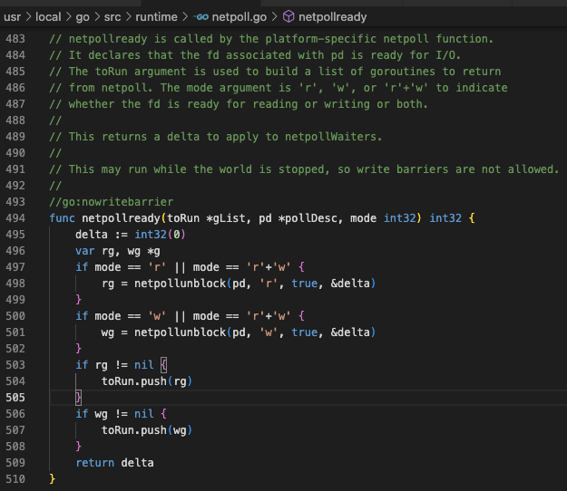
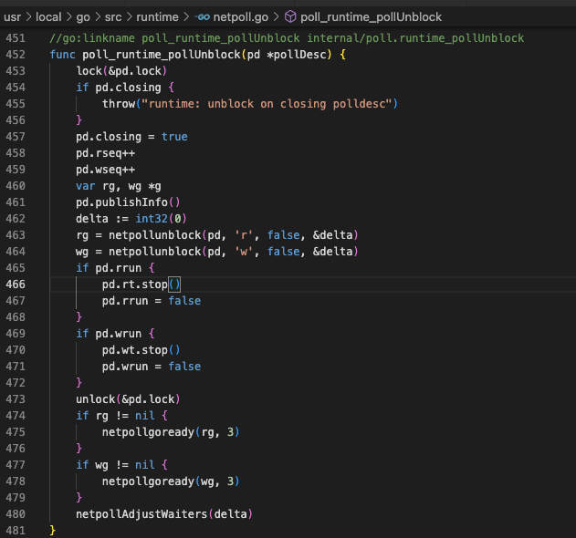

#### 最後呼叫 `goready` 來喚醒 goroutine
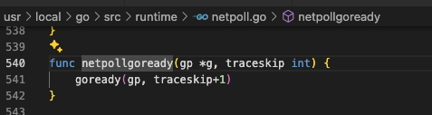

## Summary

## Single Reactor

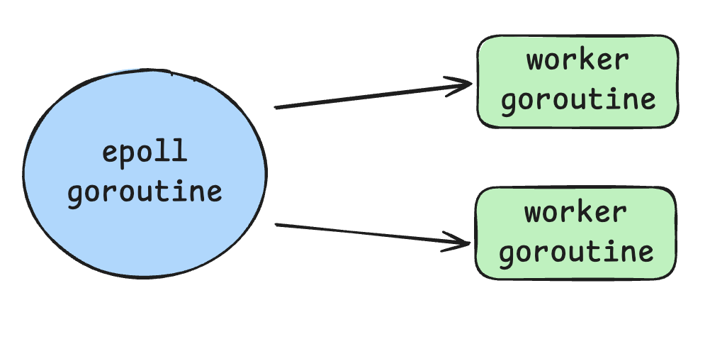

## [The edge-triggered misunderstanding](https://lwn.net/Articles/864947/)

# Multi-Reactors 異步網路模型

> 取自 gnet.host
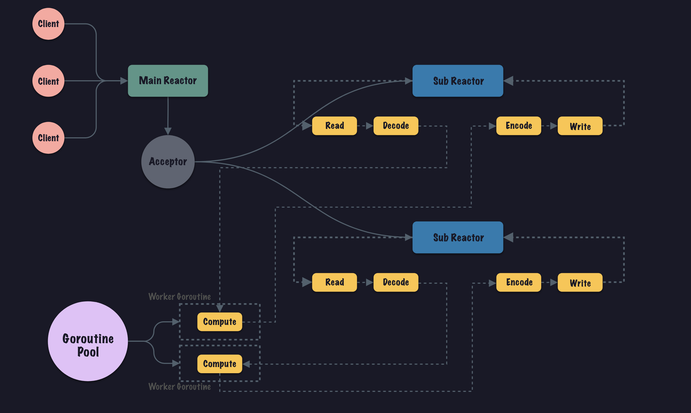

